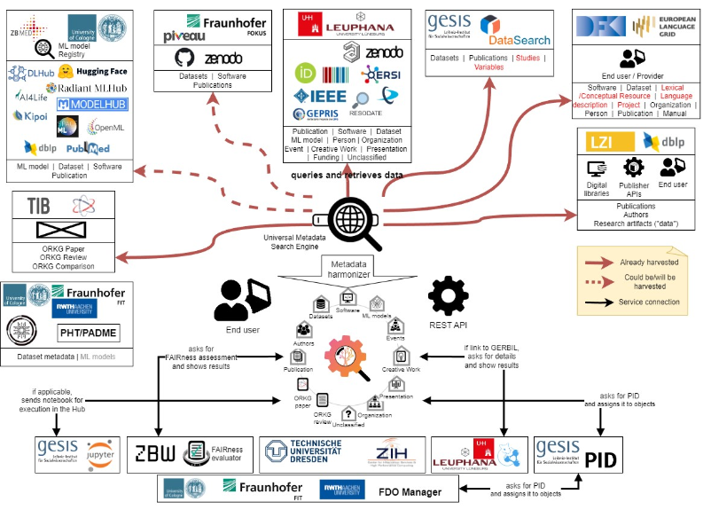

# MLentory Extraction/Transformation/Loader (ETL) Pipeline 

## Purpose
To build a system that extracts ML model information from different platforms, normalizes that data in a common format, stores it, and shares it in a FAIR Digital Object (FDO) registry to facilitate information retrieval (IR) and comparison/recommendation systems.

This TDD will help new contributors understand and old ones remember what decisions were made on the system's design, the motivation behind them, and their impact. The document focuses on the design of the ETL pipeline to collect, transform, and store extracted information.

## Background
This project is part of the NFDI4DataScience initiative, a German Consortium whose vision is to support all steps of the complex and interdisciplinary research data lifecycle, including collecting/creating, processing, analyzing, publishing, archiving, and reusing resources in Data Science and Artificial Intelligence. Our project, namely MLentory, is centered around information on  ML models, how to harmonize that data, and how to make it available and searchable on an FDO registry.



<p style=" text-align: center; font-size: 0.8em; color: #cccccc">Figure 1. General diagram of the NFDI4DataScience main project.</p>

A big effort in this project will be using semantic technologies aligned to the FDO concept, so information from various ML model platforms is stored using a common data structure, easy for semantic purposes but also optimized for IR.


<p style="text-align: center; font-size: 0.8em; color: #cccccc">Figure 2. The BETA  version of the Metadata Schema proposed by ZB MED</p>

In the end, the system and the data it collects will help researchers and other interested parties find and pick ML models from different platforms to solve their particular problems.

## Project architecture

The project architecture is the following:


<p style="text-align: center; font-size: 0.8em; color: #cccccc">Figure 3. Deployment Diagram of the whole ETL pipeline.</p>

The ETL pipeline is composed of 4 main components:

### The platform extractors

The platform extractors are the components that extract information from different platforms. They are implemented as isolated containers that communicate with the rest of the ETL pipeline through json files that are going to be used in a queue to process the information being gather from each platform.

### The Transformation pipeline

The transformation pipeline will be in charge of transforming the information extracted from the platform extractors into a common format given by the data schema described in Figure 2.

### The Loading pipeline

Will be a container in charge of uploading, updating and resolving conflicts in the information provided by the transformation pipeline, this data will be stored in the RDF database.

### The Orchestrator

Will be a container in charge of launching the pipelines in the right order, and of monitoring the status of the pipelines.

## Project structure

The project structure is the following:

- A [code](/code/) folder where the code of the ETL pipeline is located.
- A [playground](/playground/) folder where we test and get familiar with the different technologies used in the project.
- A [data](/data/) Where you can find data folders that are used in the different sections of the project.
- A [docs](/docs/) folder where you can find resources related to the project like diagrams, functions, and documentation.
- A [tests](/tests/) folder where you can find the tests configuration of the project.

```
.
├── CITATION.cff
├── LICENSE
├── README.md
├── code
│   ├── README.md
│   ├── config_data
│   ├── cuda-keyring_1.1-1_all.deb
│   ├── docker-compose.yml
│   ├── extractors
│   ├── load
│   └── transform
├── data
│   ├── anzograph_data
│   ├── datasets
│   ├── load_queue
│   ├── mysql_data
│   ├── mysql_test_data
│   ├── transform_queue
│   └── virtuoso_data
├── docs
│   ├── Analysis_graphs
│   ├── HF_legal_files
│   └── Readme_images
├── playground
│   ├── DB
│   ├── Dev_tests
│   ├── Dockerfile.gpu
│   ├── Dockerfile.no_gpu
│   ├── HF_API
│   ├── README.md
│   ├── docker-compose.yml
│   └── requirements.txt
└── tests
    ├── Dockerfile.local
    ├── Dockerfile.remote
    ├── README.md
    ├── Test_files
    ├── __pycache__
    ├── conftest.py
    ├── docker-compose.yml
    ├── pytest.ini
    ├── requirements.txt
    ├── test_extract_HF_MetadataParser.py
    ├── ...
    ├── test_transform_QueueObserver.py
    ├── validate_tests.sh
    └── wait-for-it.sh
```


## Acknowledgements

This project is part of NFDI4DataScience consortium services. [NFDI4DataScience](https://www.nfdi4datascience.de/) is funded by the [German Research Foundation (DFG)](https://www.dfg.de/), [project number 460234259](https://gepris.dfg.de/gepris/projekt/460234259).
