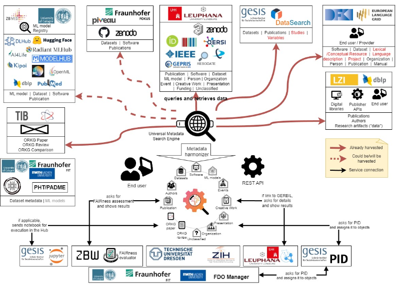

# Mlentory Data Loader

## Purpose
To build a system that extracts ML model information from different platforms, normalizes that data in a common format, stores it, and shares it in a FAIR Digital Object (FDO) registry to facilitate information retrieval (IR) and comparison/recommendation systems.

This TDD will help new contributors understand and old ones remember what decisions were made on the system's design, the motivation behind them, and their impact. The document focuses on the design of the ETL pipeline to collect, transform, and store extracted information.

## Background
This project is part of the NFDI4DataScience initiative, a German Consortium whose vision is to support all steps of the complex and interdisciplinary research data lifecycle, including collecting/creating, processing, analyzing, publishing, archiving, and reusing resources in Data Science and Artificial Intelligence. Our project, namely MLentory, is centered around information on  ML models, how to harmonize that data, and how to make it available and searchable on an FDO registry.

General diagram of the NFDI4DataScience main project.

A big effort in this project will be using semantic technologies aligned to the FDO concept, so information from various ML model platforms is stored using a common data structure, easy for semantic purposes but also optimized for IR.

The BETA  version of the Metadata Schema proposed by ZB MED

In the end, the system and the data it collects will help researchers and other interested parties find and pick ML models from different platforms to solve their particular problems.

## Project structure

The project architecture is the following:

Deployment Diagram of the whole ETL pipeline.

The idea 
